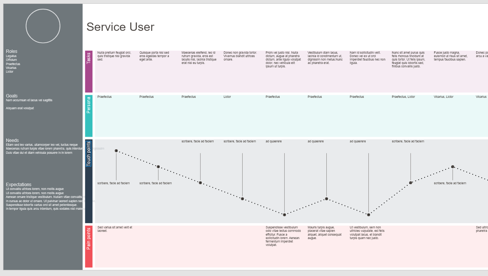

# User Journey generator for Adode XD
XD plugin to create initial layout of user journey from a CSV file
This plugin loads in user journey text from a CSV file and renders the different journey stages

##Usage
1. Prepare a CSV file with a separate row for each section as detailed in the data section below.
2. Add an artboard and run the plugin from "Plugins > User Journey" or use the shortcut (ctrl + shft + U).
3. Select and load your CSV file.
4. If the journey extends beyond the boundaires of the artboard use.
5. Add Persona images and format the graphics as required.

## Installation

### Direct

[Direct install here](https://xd.adobelanding.com/en/xd-plugin-download/?name=d95c6ba8). (Downloads plugin from xd.adobelanding.com)

### Via XD

1. Open the Plugin panel from "Plugins > Discover Plugins...".
2. Type "user journey" in the search box.
3. Click to "Install" once you have found the plugin.

### Manually

1. Download the [latest release](https://github.com/littlebusters/Resize-Artboard-to-Fit-Contents/releases/latest).
2. Double click to install.

## Data
The CSV should be arranged in the following way (see [sample CSV](blob/master/data/serviceuser.csv) for details):
The first column is the row title, with entries in the following cells for that topic

* Row 1: Persona
* Row 2: Roles
* Row 3: Goals
* Row 4: Needs
* Row 5: Expectations

This data is used to populate the side-bar of the diagram

Rows 6-11 are for the actual steps along the journey:

* Row 6: Tasks
* Row 7: Persona
* Row 8: Emotion
* Row 9: Touch points
* Row 10: Pain points

It is intended that common graphics are used for the personas, with multiple artboards used for each persona in the service.

## Example screenshot

## Bug report

Please send the report to Issues on Github.

## License

The MIT License (MIT). See LICENSE.
